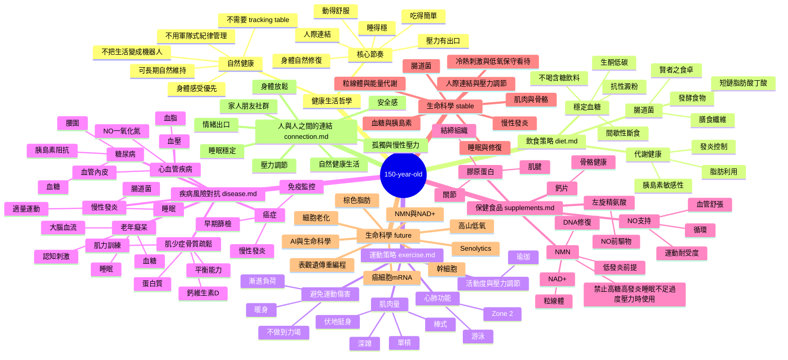
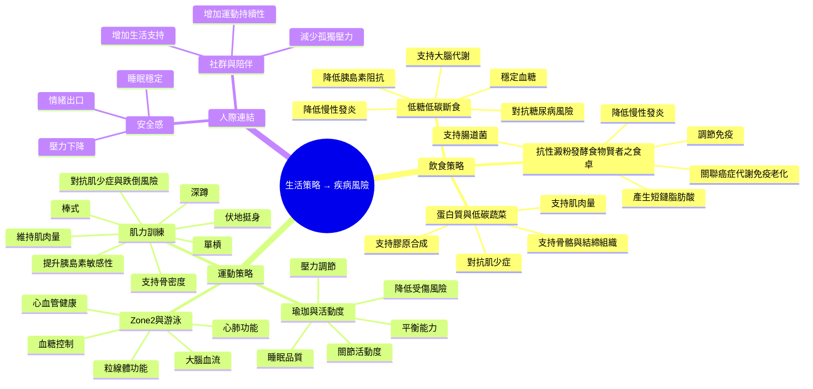
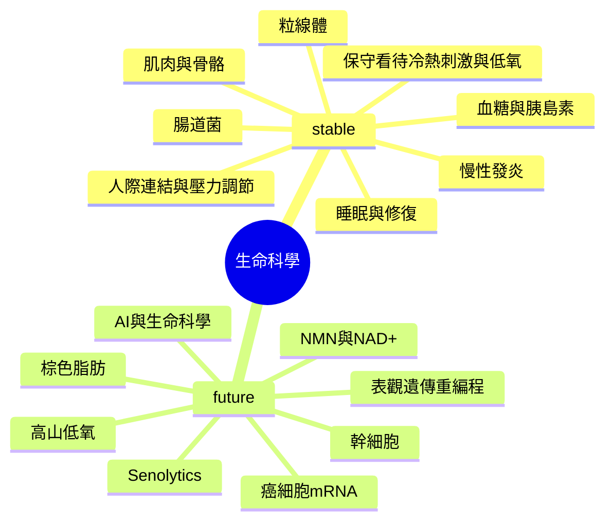

# 150-year-old 心智圖

> 目標：把 `diet.md`、`exercise.md`、`disease.md`、`supplements.md`、`life-science.md`、`connection.md` 之間的主題與關聯整理成一張可持續擴充的心智圖。

本文件提供 GitHub 可直接渲染的 Mermaid mindmap，也保留文字版關聯整理，方便之後轉成 XMind、Obsidian graph 或其他視覺化心智圖。

## Mermaid 心智圖



## Mermaid：生活策略到疾病風險



## Mermaid：生命科學 stable / future



## 關聯圖：疾病 → 對應策略

| 疾病 / 風險 | 飲食 | 運動 | 補充品 | 生命科學 | 生活方向 |
|---|---|---|---|---|---|
| 糖尿病 | 低糖、低碳、斷食、抗性澱粉 | Zone 2、肌力、餐後散步 | 謹慎使用，避免干擾藥物 | 胰島素阻抗、粒線體 | 穩定血糖與睡眠 |
| 癌症 | 減少超加工、控糖、纖維、發酵食物 | 有氧、肌力、避免久坐 | NMN 需高度謹慎 | 癌細胞 mRNA、免疫、DNA 修復 | 降低慢性發炎 |
| 老年癡呆 | 控糖、低發炎、足夠蛋白質 | Zone 2、肌力、平衡 | 依狀態謹慎評估 | 粒線體、神經退化、免疫老化 | 睡眠與認知刺激 |
| 心血管疾病 | 控糖、減少加工食品、蔬菜 | Zone 2、游泳、肌力 | NO、左旋精氨酸需注意血壓 | 血管內皮、發炎 | 壓力調節與恢復 |
| 肌少症 / 骨鬆 | 蛋白質、鈣、維生素 D | 深蹲、單槓、伏地挺身、棒式 | 鈣片、膠原蛋白 | 幹細胞、組織修復 | 維持活動能力 |
| 慢性發炎 | 低糖、發酵食物、抗性澱粉 | 適量運動、不過度訓練 | NMN 前提條件 | Senescence、免疫老化 | 睡眠與安全感 |

## 核心閉環

```text
飲食穩定血糖
→ 降低胰島素阻抗
→ 降低慢性發炎
→ 改善粒線體與免疫狀態
→ 支持健康壽命延長
```

```text
規律運動
→ 提升肌肉量與心肺功能
→ 改善血糖與血流
→ 支持骨密度與大腦功能
→ 支持健康壽命延長
```

```text
低發炎 + 睡眠穩定 + 壓力可控 + 人際連結
→ 身體進入可修復狀態
→ 身體更容易恢復
→ 生活更容易長期維持
```

## 核心方向

```text
健康不是只有飲食、運動與補充品。
生活節奏、睡眠、壓力、人際連結與身體恢復能力，也是健康長壽的一部分。
```
