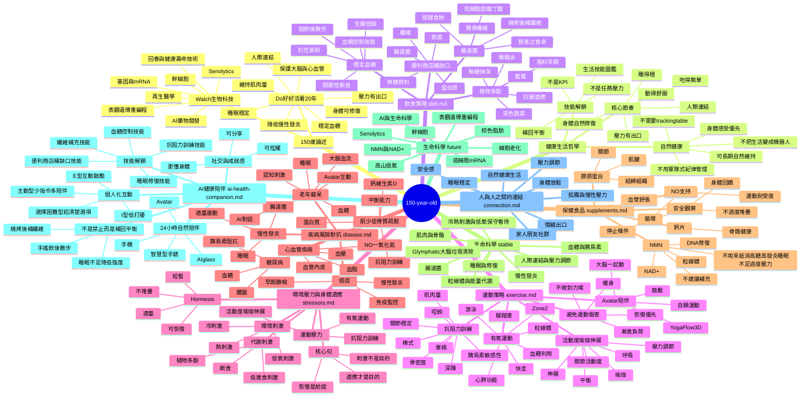
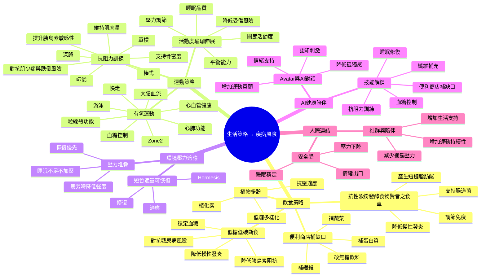
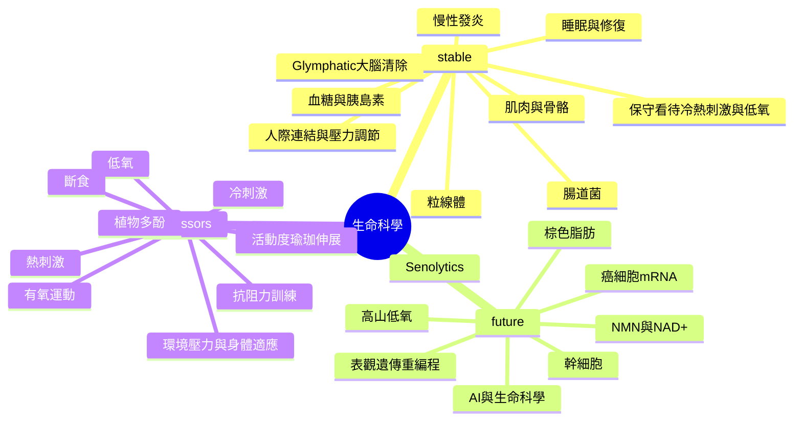

# 150-year-old 心智圖

> 目標：把 `diet.md`、`exercise.md`、`stressors.md`、`disease.md`、`supplements.md`、`life-science.md`、`ai-health-companion.md`、`connection.md` 之間的主題與關聯整理成一張可持續擴充的心智圖。

本文件提供 GitHub 可直接渲染的 Mermaid mindmap，也保留文字版關聯整理，方便之後轉成 XMind、Obsidian graph 或其他視覺化心智圖。

## Mermaid 心智圖



## Mermaid：生活策略到疾病風險



## Mermaid：生命科學 stable / future / stressors



## 關聯圖：疾病 → 對應策略

| 疾病 / 風險 | 飲食 | 運動 | 環境壓力 / 適應 | 補充品 | 生命科學 | AI / 生活方向 |
|---|---|---|---|---|---|---|
| 糖尿病 | 低糖、低碳、斷食、抗性澱粉、甜飲後補回平衡 | 有氧運動、抗阻力訓練、餐後散步 | 避免壓力堆疊，睡眠不足時不硬加壓 | 謹慎使用，避免干擾藥物 | 胰島素阻抗、粒線體 | 血糖控制技能解鎖 |
| 癌症 | 減少超加工、控糖、纖維、發酵食物 | 有氧、抗阻力、避免久坐 | 避免過度壓力，重視恢復 | NMN 需高度謹慎 | 癌細胞 mRNA、免疫、DNA 修復 | 降低慢性發炎，警訊需醫療 |
| 老年癡呆 | 控糖、低發炎、足夠蛋白質 | 有氧、抗阻力、平衡、活動度 | 睡眠與恢復優先 | 依狀態謹慎評估 | Glymphatic、粒線體、神經退化、免疫老化 | AI 對話、avatar 互動、認知刺激 |
| 心血管疾病 | 控糖、減少加工食品、蔬菜 | Zone 2、游泳、抗阻力 | 冷熱刺激需謹慎，避免極端 | NO、左旋精氨酸需注意血壓 | 血管內皮、發炎 | 壓力調節與恢復 |
| 肌少症 / 骨鬆 | 蛋白質、鈣、維生素 D | 單槓、啞鈴、深蹲、棒式 | 抗阻力訓練提供可控刺激 | 鈣片、膠原蛋白 | 肌肉、骨骼、組織修復 | Avatar 陪伴增加運動持續性 |
| 慢性發炎 | 低糖、發酵食物、抗性澱粉、纖維補充、多酚 | 適量有氧、抗阻力、活動度 | 短暫適量可恢復，避免過量 | NMN 前提條件 | Senescence、免疫老化 | 睡眠、安全感、補回平衡 |

## 核心閉環

```text
飲食穩定血糖
→ 降低胰島素阻抗
→ 降低慢性發炎
→ 改善粒線體與免疫狀態
→ 支持健康壽命延長
```

```text
有氧運動 + 抗阻力訓練 + 活動度訓練
→ 提升心肺、肌肉量、骨密度與關節活動度
→ 改善血糖、血流、平衡與大腦功能
→ 支持健康壽命延長
```

```text
短暫、適量、可恢復的壓力刺激
→ 身體啟動修復與適應
→ 恢復後更有韌性
→ 避免長期、過量、無法恢復的壓力堆疊
```

```text
低發炎 + 睡眠穩定 + 壓力可控 + 人際連結
→ 身體進入可修復狀態
→ 身體更容易恢復
→ 生活更容易長期維持
```

```text
AI陪伴 + 個人化互動 + 技能解鎖
→ 健康行為變得有趣
→ 更容易自然持續
→ 從控制生活變成理解身體
```

## 核心方向

```text
健康不是只有飲食、運動與補充品。
生活節奏、睡眠、壓力、人際連結、AI 陪伴、環境壓力適應與身體恢復能力，也是健康長壽的一部分。
```

```text
不是任務完成表。
是生活技能圖鑑。

不是監控人。
是陪人補回平衡。
```

```text
刺激不是目的。
適應才是目的。
恢復是適應的前提。
```
